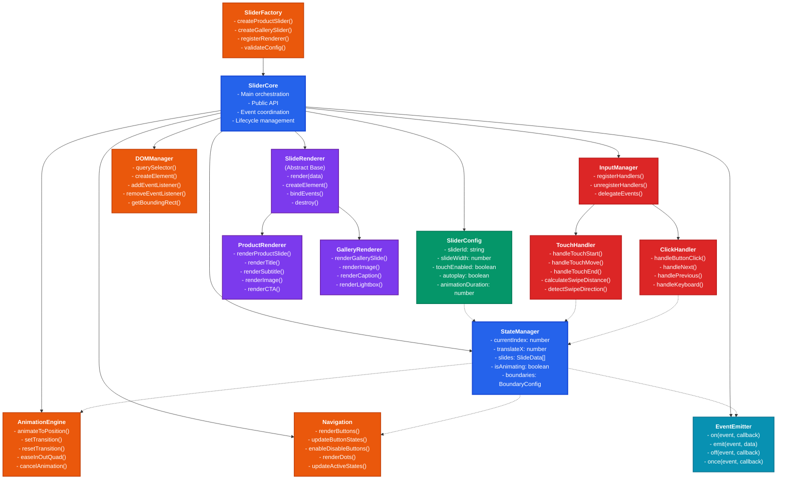

# system-architecture

```mermaid
graph TB
    %% Core Layer
    SliderCore["`**SliderCore**
    - Main orchestration
    - Public API
    - Event coordination
    - Lifecycle management`"]

    %% Configuration
    Config["`**SliderConfig**
    - sliderId: string
    - slideWidth: number
    - touchEnabled: boolean
    - autoplay: boolean
    - animationDuration: number`"]

    %% State Management
    StateManager["`**StateManager**
    - currentIndex: number
    - translateX: number
    - slides: SlideData[]
    - isAnimating: boolean
    - boundaries: BoundaryConfig`"]

    %% Input Handlers
    InputManager["`**InputManager**
    - registerHandlers()
    - unregisterHandlers()
    - delegateEvents()`"]

    TouchHandler["`**TouchHandler**
    - handleTouchStart()
    - handleTouchMove()
    - handleTouchEnd()
    - calculateSwipeDistance()
    - detectSwipeDirection()`"]

    ClickHandler["`**ClickHandler**
    - handleButtonClick()
    - handleNext()
    - handlePrevious()
    - handleKeyboard()`"]

    %% UI Components
    Navigation["`**Navigation**
    - renderButtons()
    - updateButtonStates()
    - enableDisableButtons()
    - renderDots()
    - updateActiveStates()`"]

    %% Animation System
    AnimationEngine["`**AnimationEngine**
    - animateToPosition()
    - setTransition()
    - resetTransition()
    - easeInOutQuad()
    - cancelAnimation()`"]

    %% Renderer Strategy
    SlideRenderer["`**SlideRenderer**
    (Abstract Base)
    - render(data)
    - createElement()
    - bindEvents()
    - destroy()`"]

    ProductRenderer["`**ProductRenderer**
    - renderProductSlide()
    - renderTitle()
    - renderSubtitle()
    - renderImage()
    - renderCTA()`"]

    GalleryRenderer["`**GalleryRenderer**
    - renderGallerySlide()
    - renderImage()
    - renderCaption()
    - renderLightbox()`"]

    %% DOM Utilities
    DOMManager["`**DOMManager**
    - querySelector()
    - createElement()
    - addEventListener()
    - removeEventListener()
    - getBoundingRect()`"]

    %% Factory Pattern
    SliderFactory["`**SliderFactory**
    - createProductSlider()
    - createGallerySlider()
    - registerRenderer()
    - validateConfig()`"]

    %% Event System
    EventEmitter["`**EventEmitter**
    - on(event, callback)
    - emit(event, data)
    - off(event, callback)
    - once(event, callback)`"]

    %% Core Relationships
    SliderFactory --> SliderCore
    SliderCore --> Config
    SliderCore --> StateManager
    SliderCore --> InputManager
    SliderCore --> Navigation
    SliderCore --> AnimationEngine
    SliderCore --> DOMManager
    SliderCore --> EventEmitter

    %% Input Management
    InputManager --> TouchHandler
    InputManager --> ClickHandler

    %% Renderer Strategy
    SliderCore --> SlideRenderer
    SlideRenderer --> ProductRenderer
    SlideRenderer --> GalleryRenderer

    %% Data Flow
    Config -.-> StateManager
    TouchHandler -.-> StateManager
    ClickHandler -.-> StateManager
    StateManager -.-> AnimationEngine
    StateManager -.-> Navigation
    StateManager -.-> EventEmitter

    %% Styling
    classDef coreClass fill:#2563eb,stroke:#1d4ed8,stroke-width:3px,color:#fff
    classDef configClass fill:#059669,stroke:#047857,stroke-width:2px,color:#fff
    classDef inputClass fill:#dc2626,stroke:#b91c1c,stroke-width:2px,color:#fff
    classDef rendererClass fill:#7c3aed,stroke:#6b21a8,stroke-width:2px,color:#fff
    classDef utilClass fill:#ea580c,stroke:#c2410c,stroke-width:2px,color:#fff
    classDef systemClass fill:#0891b2,stroke:#0e7490,stroke-width:2px,color:#fff

    class SliderCore,StateManager coreClass
    class Config configClass
    class InputManager,TouchHandler,ClickHandler inputClass
    class SlideRenderer,ProductRenderer,GalleryRenderer rendererClass
    class Navigation,AnimationEngine,DOMManager,SliderFactory utilClass
    class EventEmitter systemClass
```
