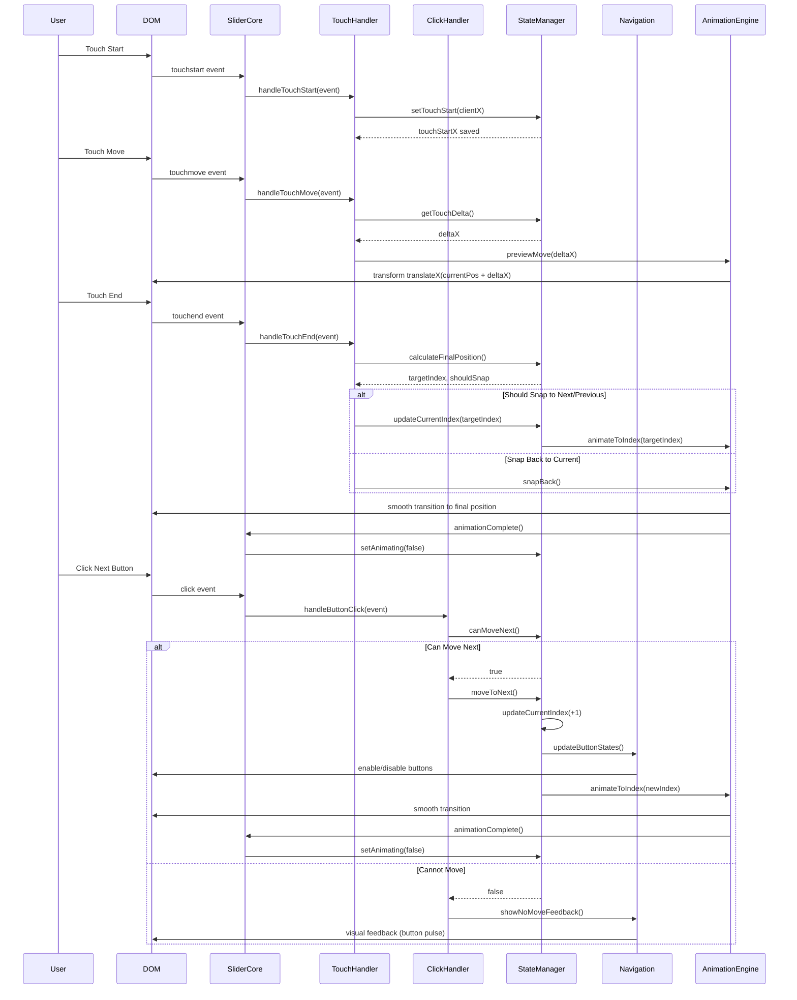

# Slider Sequence Diagram

```mermaid
sequenceDiagram
participant User
participant DOM
participant SliderCore
participant TouchHandler
participant ClickHandler
participant StateManager
participant Navigation
participant AnimationEngine

    User->>DOM: Touch Start
    DOM->>SliderCore: touchstart event
    SliderCore->>TouchHandler: handleTouchStart(event)
    TouchHandler->>StateManager: setTouchStart(clientX)
    StateManager-->>TouchHandler: touchStartX saved

    User->>DOM: Touch Move
    DOM->>SliderCore: touchmove event
    SliderCore->>TouchHandler: handleTouchMove(event)
    TouchHandler->>StateManager: getTouchDelta()
    StateManager-->>TouchHandler: deltaX
    TouchHandler->>AnimationEngine: previewMove(deltaX)
    AnimationEngine->>DOM: transform translateX(currentPos + deltaX)

    User->>DOM: Touch End
    DOM->>SliderCore: touchend event
    SliderCore->>TouchHandler: handleTouchEnd(event)
    TouchHandler->>StateManager: calculateFinalPosition()
    StateManager-->>TouchHandler: targetIndex, shouldSnap
    alt Should Snap to Next/Previous
        TouchHandler->>StateManager: updateCurrentIndex(targetIndex)
        StateManager->>AnimationEngine: animateToIndex(targetIndex)
    else Snap Back to Current
        TouchHandler->>AnimationEngine: snapBack()
    end
    AnimationEngine->>DOM: smooth transition to final position
    AnimationEngine->>SliderCore: animationComplete()
    SliderCore->>StateManager: setAnimating(false)


    User->>DOM: Click Next Button
    DOM->>SliderCore: click event
    SliderCore->>ClickHandler: handleButtonClick(event)
    ClickHandler->>StateManager: canMoveNext()

    alt Can Move Next
        StateManager-->>ClickHandler: true
        ClickHandler->>StateManager: moveToNext()
        StateManager->>StateManager: updateCurrentIndex(+1)
        StateManager->>Navigation: updateButtonStates()
        Navigation->>DOM: enable/disable buttons
        StateManager->>AnimationEngine: animateToIndex(newIndex)
        AnimationEngine->>DOM: smooth transition
        AnimationEngine->>SliderCore: animationComplete()
        SliderCore->>StateManager: setAnimating(false)
    else Cannot Move
        StateManager-->>ClickHandler: false
        ClickHandler->>Navigation: showNoMoveFeedback()
        Navigation->>DOM: visual feedback (button pulse)
    end
```
